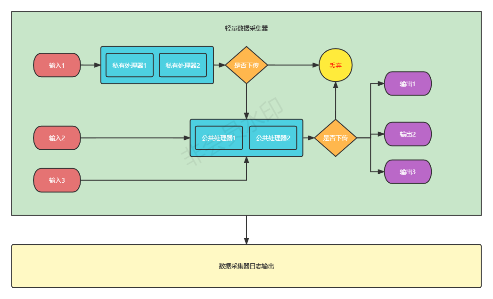
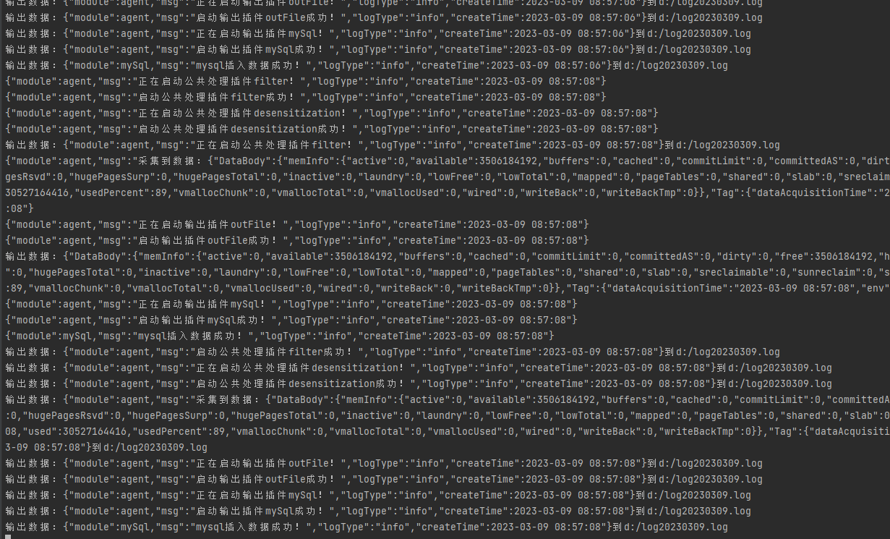
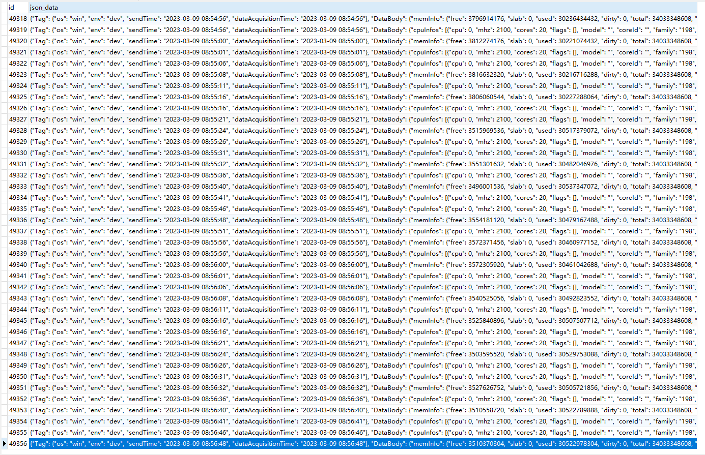
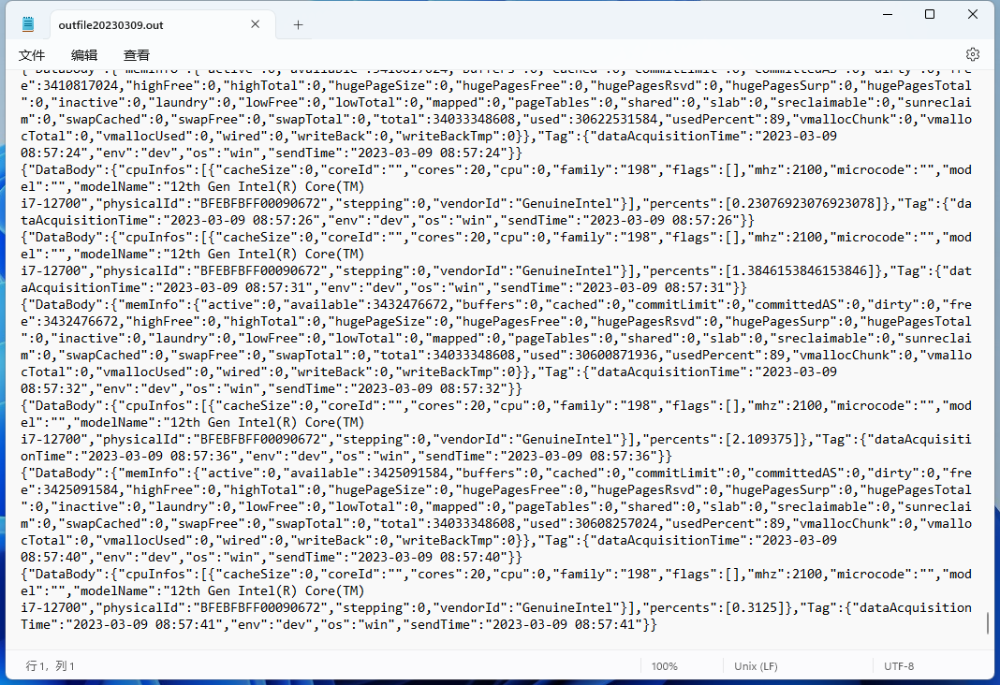

# hippo-data-acquisition

#### Description
河马数据采集器采用go语言开发，通过定时器触发每个输入插件进行数据采集，采集的数据依次通过私有处理器，再到公共处理，最终由输出插件输出。
输入和输出通过协程+管道方式进行连接，通过并行与并发方式提高性能。

#### Software Architecture


#### Directory Structure
```
agent：agent目录
commons：公共封装目录（例如：工具类） 
config：配置目录（包含配置模型）
inputs：输入插件目录
   input_collection：输入插件接口、集合目录
   plugins：每个独立插件的目录（需实现插件接口）
   register：插件注册目录
main
outputs：输出插件目录
   output_collection：输出插件接口、集合目录
   plugins：每个独立插件的目录（需实现插件接口）
   register：插件注册目录
processor：处理器插件目录
   processors_collection：处理器插件接口、集合目录
   plugins：每个独立插件的目录（需实现插件接口）
   register：插件注册目录

```

#### Installation
1.  go开发环境
2.  导入程序
3.  通过main/hippo_data_acquisition运行

#### Build

1. cd main
2. go build

### Snapshot
 </br>
 </br>
 </br>


