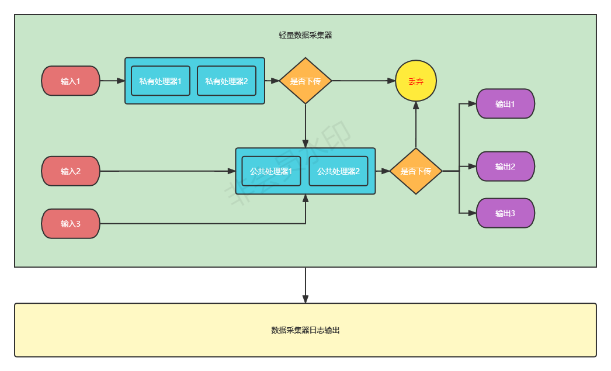

# hippo-data-acquisition

#### 介绍
河马数据采集器采用go语言开发，通过定时器触发每个输入插件进行数据采集，采集的数据通过配置的输入插件处理器，而后进入到公共处理，最终由输出插件输出。
输入和输出通过协程+管道方式进行连接，通过并行与并发方式提高性能。

#### 软件架构

#### 安装教程

1.  go开发环境
2.  导入程序
3.  通过main/hippo_data_acquisition运行

#### 打包教程

1. cd main
2. go build

