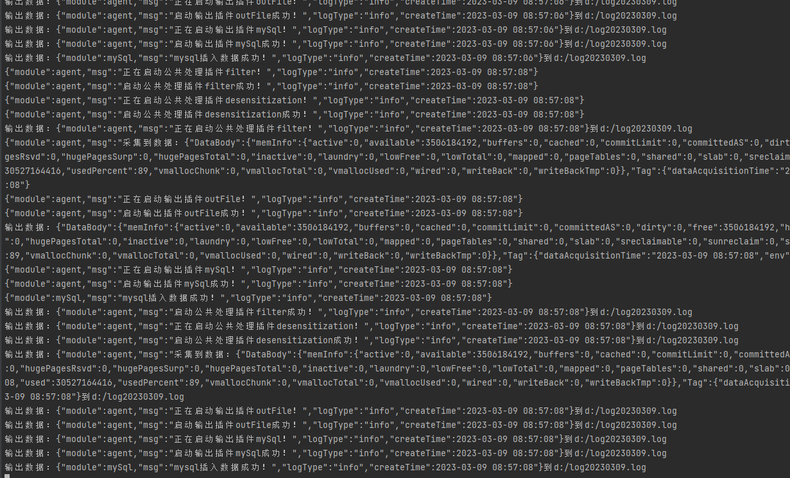
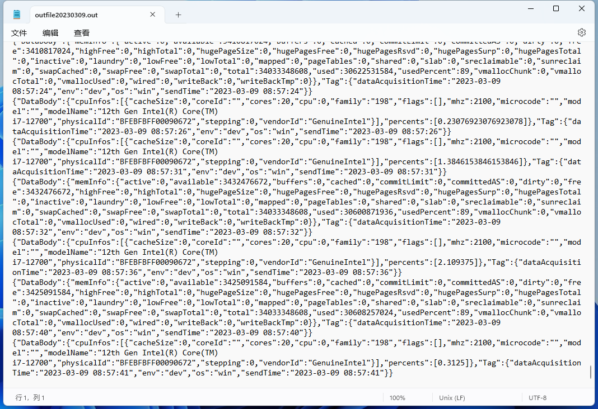

# hippo-data-acquisition

#### 介绍
河马数据采集器采用go语言开发，通过定时器触发每个输入插件进行数据采集，采集的数据依次通过私有处理器，再到公共处理，最终由输出插件输出。
输入和输出通过协程+管道方式进行连接，通过并行与并发方式提高性能。

#### 软件架构


#### 目录结构
```
agent：agent目录
commons：公共封装目录（例如：工具类） 
config：配置目录（包含配置模型）
inputs：输入插件目录
   input_collection：输入插件接口、集合目录
   plugins：每个独立插件的目录（需实现插件接口）
   register：插件注册目录
main
outputs：输出插件目录
   output_collection：输出插件接口、集合目录
   plugins：每个独立插件的目录（需实现插件接口）
   register：插件注册目录
processor：处理器插件目录
   processors_collection：处理器插件接口、集合目录
   plugins：每个独立插件的目录（需实现插件接口）
   register：插件注册目录

```


#### 安装教程

1.  go开发环境
2.  导入程序
3.  通过main/hippo_data_acquisition运行

#### 打包教程

1. cd main
2. go build

#### 输入插件开发
1. 在plugins下创建一个插件目录，例如：cpu，然后创建一个cpu.go文件。
2. 在cpu.go中添加一个结构体，例如：
```
type Cpu struct {
  // 需要输入参数的可以这定义
}
```
3. 实现输入插件接口
```
// InputPlugin 输入插件接口
type InputPlugin interface {
	// InitPlugin 初始化参数
	InitPlugin(config config.InputConfig)
	// PrepareCron 准备定时器
	PrepareCron()
	// BeforeExeDataAcquisition  执行数据采集前
	BeforeExeDataAcquisition()
	// ExeDataAcquisition  执行数据采集
	ExeDataAcquisition(dataQueue queue.Queue)
	// AfterExeDataAcquisition  执行数据采集后
	AfterExeDataAcquisition()
}

// CPU的接口实现
func (c *Cpu) InitPlugin(config config.InputConfig) {

}

func (c *Cpu) PrepareCron() {

}

func (c *Cpu) BeforeExeDataAcquisition() {

}

func (c *Cpu) ExeDataAcquisition(dataQueue queue.Queue) {
	fields := make(map[string]interface{})
	cpuInfos, percents := GetCPUPercent()
	fields["cpuInfos"] = cpuInfos
	fields["percents"] = percents
	tags := make(map[string]string)

	dataQueue.PushData(fields, tags)
}

func (c *Cpu) AfterExeDataAcquisition() {

}
```
3. 通过init函数注册
```
func init() {
	input_collection.Add("cpu", &Cpu{})
}

```
4. 在register.go中引入插件
```
import (
	_ "hippo-data-acquisition/inputs/plugins/cpu"
)

```
5. 在config/config.json中配置插件
```
{
      "inputName": "cpu", //插件名与init函数中注册的名字相同
      "tag": {  //插件的自定义标签
      },
      "params": { //插件的参数
        "spec": "*/5 * * * * *"  //如果添加spec参数则定时器按该表达式进行，否则使用全局的表达式
      },
      "processors": [ //私有表达式配置
      ]
}
```

#### 输出插件开发
大致做法同输入插件

#### 处理器插件开发
大致做法同输入插件


#### 快照
 </br>
 </br>
 </br>


